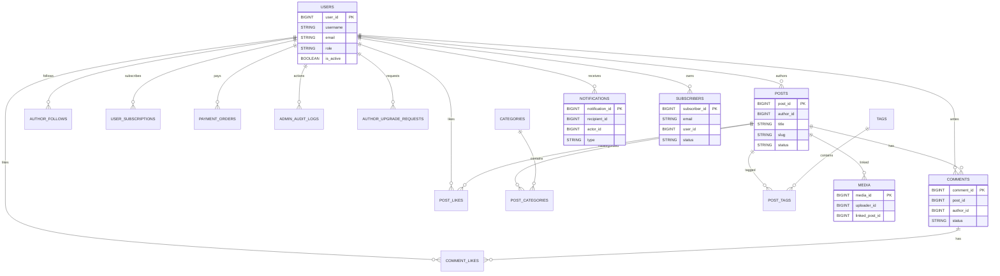
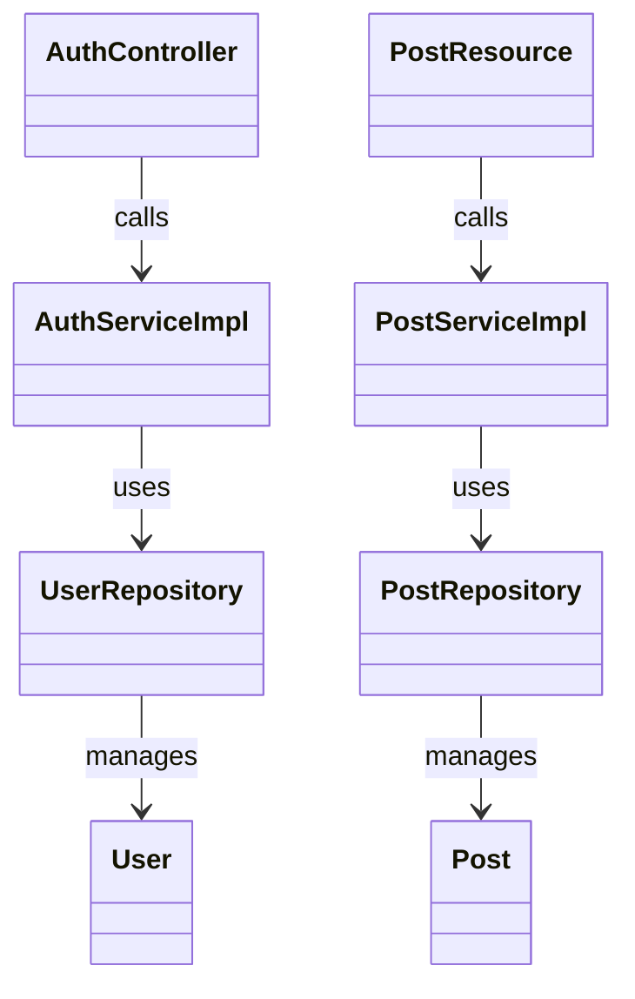
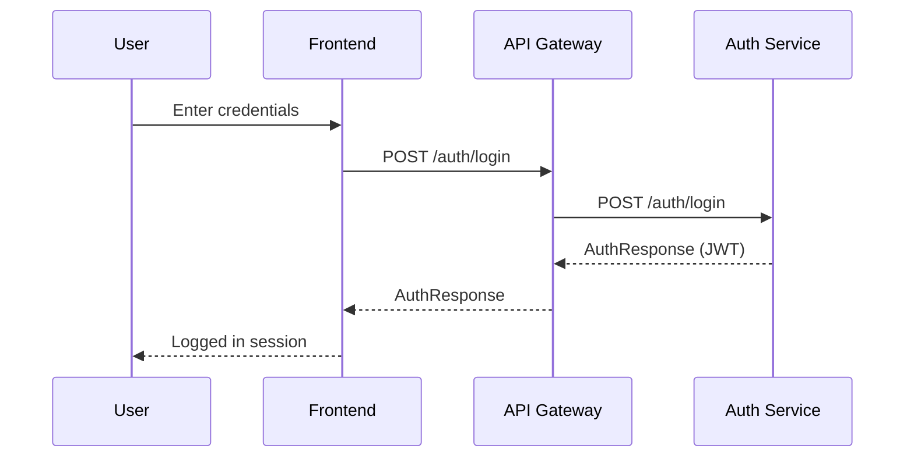
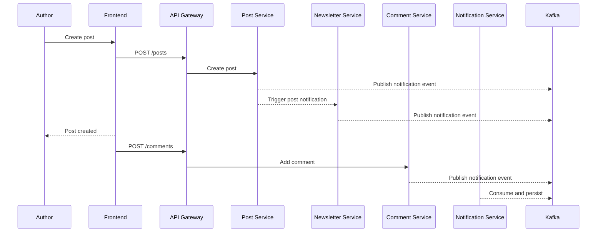

# Inkwell - Software Design Document (SDD)

## 1. Project Overview

### Project name
Inkwell

### Problem statement
Modern blogging platforms often couple authoring, publishing, media handling, notifications, and subscription billing into a monolith, making scaling and feature evolution difficult. There is a need for a modular, service-oriented platform that supports content creation, community interactions, media storage, and subscription-driven features with clear security boundaries.

### Objective
Deliver a microservices-based blogging platform that supports user authentication, authoring workflows, taxonomy management, media handling, comments, notifications, and newsletter distribution while maintaining scalability, clear separation of concerns, and secure API access.

### Key features
- JWT-based authentication and role-based authorization (READER, AUTHOR, ADMIN).
- Post lifecycle management: draft, publish, unpublish, feature, view counts, likes.
- Commenting with moderation, replies, and mentions.
- Categories and tags with post associations and trending tags.
- Media upload, metadata updates, and post linking with optional S3 storage.
- Notifications: in-app, email, unread count caching.
- Newsletter subscriptions, preferences, and broadcast/post notifications.
- Admin capabilities: audit logs, user management, author upgrade requests, subscriptions.

---

## 2. Tech Stack

### Frontend
- React (Vite) with React Router
- Tailwind CSS
- TipTap editor

### Backend
- Java 17
- Spring Boot 3.2.x
- Spring Web, Spring Security, Spring Data JPA
- Spring Cloud Gateway, Eureka (service registry)
- Spring Kafka
- Spring Mail
- Springdoc OpenAPI

### Database
- MySQL (single logical database shared by services)
- H2 for local/dev runtime in some services

### Tools and DevOps
- Maven multi-module build
- JaCoCo coverage, SonarQube integration
- Docker Compose for Kafka and ZooKeeper
- Centralized logging via Logback (`common-logback-spring.xml`)

---

## 3. System Architecture

### High-level architecture
Inkwell is organized as a set of independent Spring Boot services registered in Eureka. Traffic enters via API Gateway (Spring Cloud Gateway), which handles routing and JWT validation, then forwards requests to downstream services. Shared infrastructure includes a MySQL database, Redis for caching (views and unread counts), Kafka for notification dispatch, SMTP for mail delivery, and optional S3-compatible object storage for media.

### Microservices
- service-registry (Eureka)
- api-gateway
- auth-service
- post-service
- comment-service
- category-service
- media-service
- newsletter-service
- notification-service

### API Gateway
The API Gateway provides a single entry point, JWT validation, and routes to services. Downstream services use headers such as `X-User-Id`, `X-User-Role`, and `X-User-Email` for authorization and audit trails.

### Architecture diagram (Mermaid)
**Explanation:** The diagram shows the frontend calling the API Gateway, which routes to multiple microservices registered in Eureka. Services share MySQL and interact with Redis, Kafka, SMTP, and S3 as needed.

```mermaid
flowchart LR
  FE[Frontend (Vite + React)] -->|HTTP/REST| GW[API Gateway]
  GW -->|Service Discovery| REG[Eureka Registry]

  GW --> AUTH[Auth Service]
  GW --> POST[Post Service]
  GW --> COMMENT[Comment Service]
  GW --> CATEGORY[Category Service]
  GW --> MEDIA[Media Service]
  GW --> NEWS[Newsletter Service]
  GW --> NOTIF[Notification Service]

  AUTH --> DB[(MySQL)]
  POST --> DB
  COMMENT --> DB
  CATEGORY --> DB
  MEDIA --> DB
  NEWS --> DB
  NOTIF --> DB

  POST --> REDIS[(Redis)]
  NOTIF --> REDIS

  AUTH --> KAFKA[(Kafka)]
  POST --> KAFKA
  COMMENT --> KAFKA
  NEWS --> KAFKA
  NOTIF --> KAFKA

  MEDIA --> S3[(S3 / Object Storage)]
  AUTH --> SMTP[(SMTP)]
  NEWS --> SMTP
  NOTIF --> SMTP
```

---

## 4. Module Breakdown

### api-gateway
- Routes requests to backend services.
- Validates JWT and propagates user headers.
- Central OpenAPI access.

### service-registry
- Eureka service discovery for dynamic routing.

### auth-service
- User registration, login, OTP flows, token validation.
- Role management, admin audit logging, author upgrade requests.
- Subscription plans and entitlement checks.

### post-service
- Post CRUD, publish/unpublish, feature posts.
- View counts with session-based dedupe (Redis-backed).
- Likes and author follows.

### comment-service
- Comment CRUD, moderation workflows, replies.
- Mentions and notification triggers.
- Comment likes and counts.

### category-service
- Category and tag CRUD.
- Post-category and post-tag links.
- Trending tags.

### media-service
- Media upload, metadata updates, post linking.
- Local or S3-backed storage.
- Cleanup of deleted media.

### newsletter-service
- Subscription lifecycle: subscribe, confirm, unsubscribe.
- Preference management and admin broadcasts.
- Post-publish email notifications.

### notification-service
- Notification send (single/bulk), email, and unread tracking.
- Read/unread management and caching.

### inkwell-frontend
- UI for reading, authoring, admin panels, and profile management.
- Uses the gateway for all API access.

---

## 5. Database Design

### Entities and relationships
All services share a single MySQL database schema. Relationships are logical and enforced at the service level (via IDs), with unique constraints on key join tables.

Key entities:
- `users`, `email_otp_tokens`, `author_upgrade_requests`, `payment_orders`, `user_subscriptions`, `admin_audit_logs`
- `posts`, `post_likes`, `author_follows`
- `comments`, `comment_likes`
- `categories`, `tags`, `post_categories`, `post_tags`
- `media`
- `subscribers`
- `notifications`

### ER diagram (Mermaid)
**Explanation:** This ER model shows the logical relationships between user identity, content, taxonomy, engagement, and notifications. Many relations are implemented via IDs rather than foreign key constraints to keep services decoupled.



### Key tables explanation
- `users`: identity, roles, profile metadata, provider.
- `posts`: content, slug, status, view/like counters.
- `comments`: threaded comments with moderation status.
- `categories`, `tags`: taxonomies and post counts.
- `post_categories`, `post_tags`: many-to-many mappings.
- `media`: upload metadata and post linkage.
- `notifications`: recipient/actor, type, message, read state.
- `subscribers`: newsletter subscription state and preferences.
- `user_subscriptions` and `payment_orders`: subscription billing records.
- `author_upgrade_requests` and `admin_audit_logs`: admin workflows and auditability.

---

## 6. Class Diagram

**Explanation:** The diagram highlights the typical layered structure (Controller -> Service -> Repository -> Entity) for core services, emphasizing dependency flow and separation of concerns.



---

## 7. API Design

### Major APIs (representative)

#### Auth service
- `POST /auth/register`
- `POST /auth/login`
- `POST /auth/refresh`
- `GET /auth/validate`
- `GET /auth/profile`
- `PUT /auth/profile`
- `POST /auth/profile/become-author`
- `GET /auth/admin/author-requests`

Example request:
```json
POST /auth/login
{
  "email": "user@example.com",
  "password": "Password@123"
}
```

Example response:
```json
{
  "accessToken": "<jwt>",
  "tokenType": "Bearer",
  "expiresAt": 1710000000000,
  "user": {
    "userId": 1,
    "username": "jane",
    "role": "READER"
  }
}
```

#### Post service
- `POST /posts`
- `GET /posts/{postId}`
- `GET /posts/slug/{slug}`
- `PUT /posts/{postId}`
- `PUT /posts/{postId}/publish`
- `POST /posts/{postId}/like`
- `POST /posts/{postId}/views`

Headers:
- `X-User-Id`, `X-User-Role` for authorization

#### Comment service
- `POST /comments`
- `GET /comments/post/{postId}`
- `PUT /comments/{commentId}`
- `PUT /comments/{commentId}/approve`
- `PUT /comments/{commentId}/like`

#### Category and Tag service
- `POST /categories`, `PUT /categories/{id}`, `GET /categories`
- `POST /tags`, `PUT /tags/{id}`, `GET /tags`

#### Media service
- `POST /media` (multipart upload)
- `PUT /media/{id}/alt-text`
- `POST /media/link`, `POST /media/{id}/unlink`

#### Newsletter service
- `POST /newsletter/subscribe`
- `GET /newsletter/confirm?token=...`
- `POST /newsletter/send-newsletter`

#### Notification service
- `POST /notifications`
- `POST /notifications/bulk`
- `GET /notifications/recipient/{id}`
- `GET /notifications/unread-count?recipientId=...`

### Authentication flow
- Clients authenticate via `/auth/login` and receive a JWT.
- JWT is sent as `Authorization: Bearer <token>` to the gateway.
- Gateway validates JWT and forwards user context headers to services.
- Admin routes check `X-User-Role = ADMIN` in downstream controllers.

---

## 8. Workflow / Sequence Diagrams

### User login flow
**Explanation:** The client sends credentials to auth-service, receives a JWT, and includes it in subsequent requests through the API gateway.



### Post and comment flow
**Explanation:** A user publishes a post, followers and subscribers are notified, and another user comments. Notification events are dispatched via Kafka.



---

## 9. Screenshots Section

Add UI screenshots in the following locations:
- [Insert Screenshot: Login Page] - Show login form and error handling.
- [Insert Screenshot: Home/Feed] - Show list of published posts.
- [Insert Screenshot: Post Editor] - Show rich text editor and publish controls.
- [Insert Screenshot: Post Detail] - Show comments, likes, and metadata.
- [Insert Screenshot: Profile Page] - Show user profile, role, and settings.
- [Insert Screenshot: Admin Panel] - Show user management and author requests.
- [Insert Screenshot: Newsletter Page] - Show subscription status and preferences.
- [Insert Screenshot: Notifications] - Show unread and read notifications.

---

## 10. CI/CD and Deployment

### Pipeline (current and recommended)
- Maven multi-module build with unit tests and JaCoCo reports.
- SonarQube analysis is supported via Maven command.
- Recommended CI: GitHub Actions to run `mvn test` and `mvn verify` with JaCoCo and SonarQube steps.

### Deployment strategy
- Local dev: start services via `start-backend.ps1` and run frontend via Vite.
- Infra services: Kafka/ZooKeeper via Docker Compose.
- Production-ready approach: containerize each service with Docker and deploy behind a gateway, with environment-based configuration for DB, Redis, Kafka, and SMTP.

---

## 11. Challenges and Solutions

- **Cross-service authorization:** Downstream services require user identity and role. Solution: JWT validation at the gateway and propagation of `X-User-*` headers.
- **Notification fanout:** Multiple services emit notifications. Solution: Kafka-based event dispatch with a centralized notification-service.
- **View count accuracy:** Avoid duplicate views from the same session. Solution: Redis-backed session view de-duplication with TTL.
- **Media storage variability:** Support local and S3 storage. Solution: storage abstraction with configurable mode and S3 client.
- **Newsletter compliance:** Opt-in and unsubscribe flow. Solution: tokenized confirmation and unsubscribe endpoints.

---

## 12. Future Enhancements

- Full OAuth redirect flows and refresh token rotation.
- Advanced search (full-text indexing) for posts and comments.
- GraphQL or BFF layer for the frontend.
- Multi-tenant support and per-tenant themes.
- Distributed tracing (OpenTelemetry) for service observability.

---

## 13. Conclusion

Inkwell delivers a production-grade, microservices-based blogging platform with clear separation of concerns, secure authentication, and scalable content workflows. The design balances developer velocity with operational robustness through standardized Spring Boot services, centralized routing, and event-driven notifications.

