# Inkwell - Software Design Document

## 1. Project Overview

### Project Name
Inkwell

### Problem Statement
Traditional blogging systems often bundle authentication, content publishing, media management, notifications, and subscriptions into a single monolith. This increases release risk, slows feature delivery, and makes independent scaling difficult.

### Objective
Build a production-grade, modular blogging platform where each domain (identity, posts, comments, taxonomy, media, newsletters, notifications) is independently deployable while preserving a unified user experience through a central API Gateway.

### Key Features
- JWT-based authentication with role control (`READER`, `AUTHOR`, `ADMIN`)
- Content lifecycle management (draft, publish, unpublish, feature)
- Follow/like/comment engagement model
- Category/tag taxonomy with post mapping and trending tags
- Media upload and post linkage with S3-backed storage option
- Event-driven notification dispatch through Kafka
- Newsletter subscription, confirmation, preferences, and campaign send
- Admin workflows (audit logs, role updates, author upgrade decisions, subscription oversight)

## 2. Tech Stack

### Frontend
- React 19 + Vite 5
- React Router 7
- Tailwind CSS
- TipTap rich-text editor
- Framer Motion

### Backend
- Java 17
- Spring Boot 3.2.5
- Spring Web / Security / Validation / Data JPA
- Spring Cloud Gateway + Eureka (Netflix)
- Spring Kafka
- Spring Mail
- Spring Data Redis
- Springdoc OpenAPI
- JWT (`jjwt`)

### Database
- MySQL (primary runtime)
- H2 (runtime profile support in services)
- Service-specific schemas/entities with shared platform model strategy

### Tools and DevOps
- Maven multi-module build
- JaCoCo coverage reports (per module + aggregate)
- SonarQube scan integration via Maven
- Docker Compose (Kafka/ZooKeeper)
- Centralized log configuration (`common-logback-spring.xml`)

## 3. System Architecture

### High-Level Architecture
Inkwell follows a gateway-centric microservices architecture:
- Frontend sends all requests to `api-gateway` (`:8080`).
- Gateway validates JWT for protected routes and forwards identity headers.
- Services are discovered through Eureka (`service-registry`, `:8761`).
- Stateful and async concerns are externalized:
  - MySQL for persistence
  - Redis for hot counters/cache
  - Kafka for decoupled event dispatch
  - SMTP for email notifications
  - S3-compatible object storage for media assets

### Microservices
- `service-registry` (`:8761`) - Eureka registry
- `api-gateway` (`:8080`) - entry point + routing + token validation
- `auth-service` (`:8081`) - auth, users, subscriptions, admin workflows
- `post-service` (`:8082`) - post lifecycle, likes, follows, views
- `comment-service` (`:8083`) - comments, moderation, replies
- `category-service` (`:8084`) - categories, tags, post taxonomy mapping
- `media-service` (`:8085`) - media upload, metadata, post linking
- `newsletter-service` (`:8086`) - subscriber lifecycle + campaigns
- `notification-service` (`:8087`) - notification persistence + unread cache + email

### API Gateway Role
- Single external entry point
- Service discovery-based routing
- Swagger aggregation endpoints
- Security context propagation via headers (example: `X-User-Id`, `X-User-Role`, `X-User-Email`)

### Architecture Diagram - Explanation
The diagram shows client-to-gateway flow, service discovery via Eureka, and each service's integration with shared infrastructure (MySQL, Redis, Kafka, SMTP, S3).

### Architecture Diagram - Mermaid.js Code
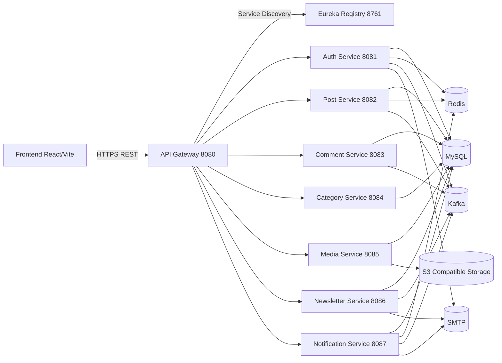

### Architecture Diagram - Rendered

## 4. Module Breakdown

| Module | Core Responsibility | Key Behaviors |
|---|---|---|
| api-gateway | API entry and routing | Route mapping, CORS, JWT filter, aggregated OpenAPI |
| service-registry | Service discovery | Eureka registry and lookup |
| auth-service | Identity and access | Register/login/refresh, profile, role/state changes, author upgrade, subscription billing workflows |
| post-service | Publishing domain | Post CRUD/lifecycle, views, likes, author follow graph, publish notification triggers |
| comment-service | Discussion domain | Comment CRUD, replies, moderation queue, comment likes, mention events |
| category-service | Taxonomy domain | Category/tag CRUD and post mapping tables |
| media-service | Asset management | Upload/update/link/unlink/delete media, storage abstraction (S3/local) |
| newsletter-service | Email subscription domain | Subscribe/confirm/unsubscribe/preferences, newsletters, post mailers |
| notification-service | Multi-channel notifications | Single/bulk notifications, unread count, read/delete operations, Kafka consumer side effects |
| inkwell-frontend | User experience | Auth flows, feed, editor, engagement, profile/admin screens |

## 5. Database Design

### Entities and Relationships
The platform uses domain-driven entity sets across services. Main relationship axes:
- User identity and authorization
- Content ownership and engagement
- Taxonomy mapping
- Subscription and communication lifecycle

### Core Entity Set
- Auth: `User`, `EmailOtp`, `AuthorUpgradeRequest`, `PaymentOrder`, `UserSubscription`, `AuditLog`
- Post: `Post`, `PostLike`, `AuthorFollow`
- Comment: `Comment`, `CommentLike`, `AppUser`
- Category: `Category`, `Tag`, `PostCategory`, `PostTag`
- Media: `Media`
- Newsletter: `Subscriber`
- Notification: `Notification`, `AppUser`

### ER Diagram - Explanation
The model emphasizes ownership (`User -> Post/Comment`), many-to-many post taxonomy, and event-driven communication artifacts (subscription + notification).

### ER Diagram - Mermaid.js Code
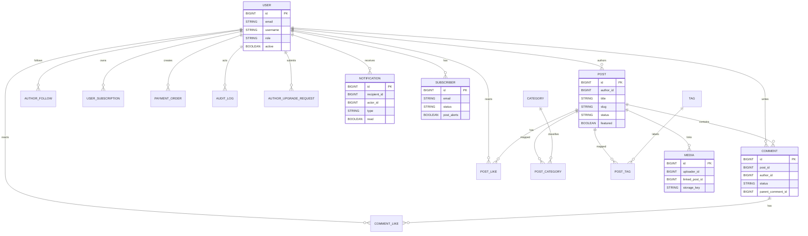

### ER Diagram - Rendered

### Key Tables/Entities Explanation
- `User`: primary identity, role, and account status
- `Post`: publishing unit with status and metadata
- `Comment`: threaded discussion and moderation status
- `PostCategory`/`PostTag`: many-to-many taxonomy mapping
- `Media`: object metadata and post linkage
- `Subscriber`: email lifecycle and preference flags
- `Notification`: channel-neutral notification payload/read state
- `UserSubscription`/`PaymentOrder`: monetization and entitlement state

## 6. Class Diagram

### Diagram Explanation
The class model follows layered architecture. Controllers orchestrate requests, services implement business logic, repositories manage persistence, and entities represent domain state.

### Class Diagram - Mermaid.js Code
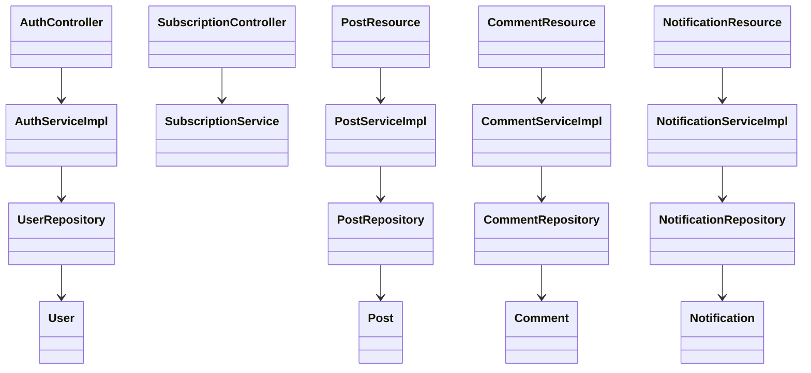

### Class Diagram - Rendered

## 7. API Design

### Major API Surface (Representative)

| Service | Endpoint | Method | Purpose |
|---|---|---|---|
| Auth | `/auth/register`, `/auth/login`, `/auth/refresh` | POST | Signup, login, token refresh |
| Auth | `/auth/profile`, `/auth/users/{userId}` | GET/PUT | Profile and admin user management |
| Auth | `/auth/subscriptions/order`, `/auth/subscriptions/verify` | POST | Subscription payment flow |
| Post | `/posts`, `/posts/{postId}/publish`, `/posts/{postId}/like` | POST/PUT | Authoring, publishing, engagement |
| Post | `/posts/authors/{authorId}/follow` | POST/DELETE | Follow graph operations |
| Comment | `/comments`, `/comments/{commentId}/approve` | POST/PUT | Add and moderate comments |
| Category | `/categories`, `/tags`, `/tags/post` | CRUD | Taxonomy and post mappings |
| Media | `/media`, `/media/link`, `/media/{mediaId}/unlink` | POST | Upload and link media |
| Newsletter | `/newsletter/subscribe`, `/newsletter/confirm`, `/newsletter/send-newsletter` | POST/GET | Subscriber lifecycle and campaigns |
| Notification | `/notifications`, `/notifications/bulk`, `/notifications/unread-count` | POST/GET | Notification operations |

### Request/Response Example - Login
Request:
```json
POST /auth/login
{
  "email": "author@inkwell.com",
  "password": "StrongPassword#1"
}
```

Success Response:
```json
{
  "accessToken": "<jwt-token>",
  "tokenType": "Bearer",
  "expiresAt": 1760000000000,
  "user": {
    "userId": 42,
    "username": "author42",
    "role": "AUTHOR"
  }
}
```

Error Response (Example):
```json
{
  "timestamp": "2026-04-21T10:21:00Z",
  "status": 401,
  "error": "Unauthorized",
  "message": "Invalid credentials",
  "path": "/auth/login"
}
```

### Request/Response Example - Create Post
Request:
```json
POST /posts
{
  "title": "Event-Driven Notifications in Spring",
  "content": "Long-form markdown/html content",
  "excerpt": "How Kafka decouples side-effects.",
  "categoryIds": [1, 2],
  "tagIds": [7, 11]
}
```

Success Response:
```json
{
  "id": 1001,
  "title": "Event-Driven Notifications in Spring",
  "slug": "event-driven-notifications-in-spring",
  "status": "DRAFT",
  "authorId": 42,
  "createdAt": "2026-04-21T10:32:00Z"
}
```

### Authentication and Authorization Flow
- Step 1: Client authenticates with `/auth/login` and receives JWT.
- Step 2: Client sends `Authorization: Bearer <token>` to gateway.
- Step 3: Gateway validates token and forwards user context headers.
- Step 4: Downstream services enforce role/ownership rules.
- Step 5: Internal service-to-service calls can use `internal-api-key` where configured.

## 8. Workflow / Sequence Diagrams

### 8.1 User Login Flow

#### Explanation
Shows credential submission, token issuance, and token-based subsequent access through gateway.

#### Mermaid.js Code
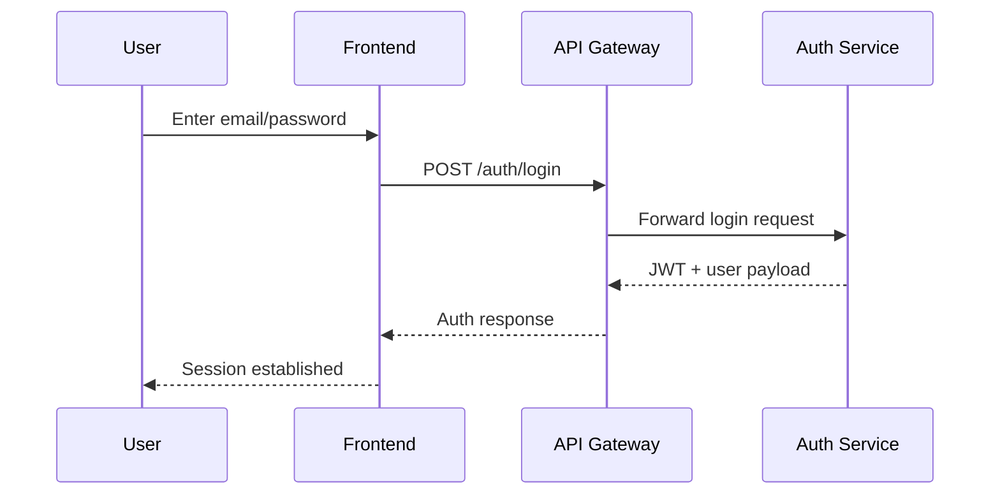

#### Rendered
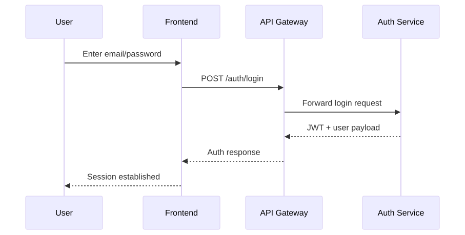

### 8.2 Post Publish + Comment + Notification Flow

#### Explanation
Shows how publish/comment actions fan out through Kafka and are consumed by notification services while preserving user-facing synchronous response.

#### Mermaid.js Code
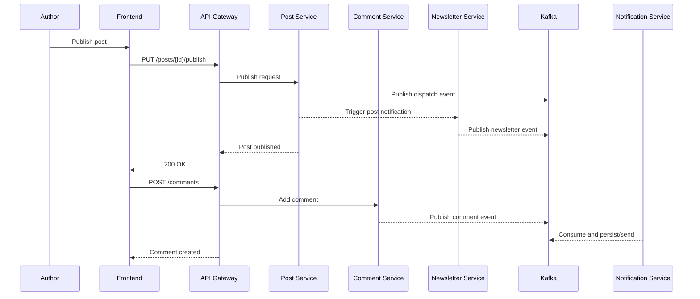

#### Rendered
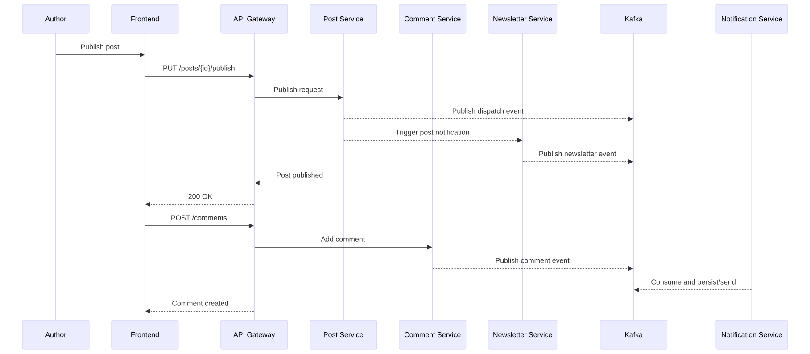

## 9. Screenshots Section (Placement Guide)

- [Insert Screenshot: Login Page]  
  Show email/password form, OAuth options, and validation errors.

- [Insert Screenshot: Signup with OTP]  
  Show OTP request, verification step, and successful account creation state.

- [Insert Screenshot: Home Feed]  
  Show published posts list, filters, and featured content.

- [Insert Screenshot: Post Editor]  
  Show rich text editing, category/tag assignment, and publish action.

- [Insert Screenshot: Post Details + Comments]  
  Show post content, likes/views, threaded comments, and reply actions.

- [Insert Screenshot: Author Profile]  
  Show follower controls, authored post list, and profile metadata.

- [Insert Screenshot: Newsletter Preferences]  
  Show subscription status, preference toggles, and unsubscribe action.

- [Insert Screenshot: Notifications Panel]  
  Show unread count, mark-read actions, and notification types.

- [Insert Screenshot: Admin Dashboard]  
  Show user management, author upgrade decisions, and audit log list.

## 10. CI/CD and Deployment

### CI/CD Pipeline (Recommended)
- Trigger: push/PR on main branches
- Stage 1: Build each Maven module (`mvn -q -DskipTests=false test`)
- Stage 2: Coverage + verification (`mvn verify`)
- Stage 3: Static quality gate (SonarQube)
- Stage 4: Docker build and image tagging per service
- Stage 5: Deploy to target environment (dev/stage/prod)

### CI/CD Flow Diagram - Explanation
This flow shows quality gates before image publish and environment deployment.

### CI/CD Flow Diagram - Mermaid.js Code
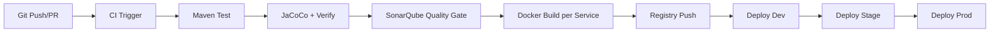

### CI/CD Flow Diagram - Rendered


### Deployment Strategy
- Local:
  - Start `service-registry` and `api-gateway`
  - Start each domain service (`8081`-`8087`)
  - Frontend runs via Vite (`5173`)
  - Kafka/ZooKeeper via `docker-compose.kafka.yml`
- Production:
  - Containerize each microservice
  - Externalize config via environment variables/secrets manager
  - Place gateway behind TLS reverse proxy/load balancer
  - Use managed DB/Redis/Kafka for resilience

## 11. Challenges and Solutions

| Challenge | Risk | Implemented/Recommended Solution |
|---|---|---|
| Cross-service authorization | Inconsistent access checks | Validate JWT at gateway, propagate user context headers, re-check roles in service layer |
| Notification fan-out from multiple domains | Tight coupling and retries complexity | Kafka event dispatch + dedicated notification consumer service |
| Accurate view counting | Inflated counts via refresh loops | Redis-backed session dedup key with TTL |
| Media storage portability | Vendor lock-in and migration overhead | Storage abstraction with configurable S3/local provider |
| Moderation latency vs openness | Abuse or poor UX | Configurable moderation mode (`pending` vs immediate approval path) |
| Shared DB vs service autonomy | Domain coupling | Keep ownership by service and migrate to separate schemas progressively |

## 12. Future Enhancements

- Refresh token rotation with revocation lists
- Full OAuth redirect flows and enterprise SSO providers
- OpenTelemetry tracing and distributed correlation IDs
- Search index (Elasticsearch/OpenSearch) for full-text content discovery
- Async outbox pattern for guaranteed event delivery
- Fine-grained policy engine (ABAC/RBAC hybrid)
- Blue/green deployment and automated rollback strategy

## 13. Conclusion

Inkwell demonstrates a production-oriented microservices architecture with clear domain boundaries, scalable communication patterns, and modern Spring-based implementation practices. The design supports continuous feature growth (content, engagement, subscriptions, notifications) while preserving operational flexibility through gateway routing, service discovery, event-driven integration, and modular deployability.

## Assumptions and Scope Notes

- This document is derived from the current repository structure and configuration files as of 2026-04-21.
- Where runtime infrastructure (cloud provider, CI runner, production topology) is not explicitly committed, practical production assumptions are provided.
- Secrets present in local development config are intentionally treated as environment-managed in this design document.
